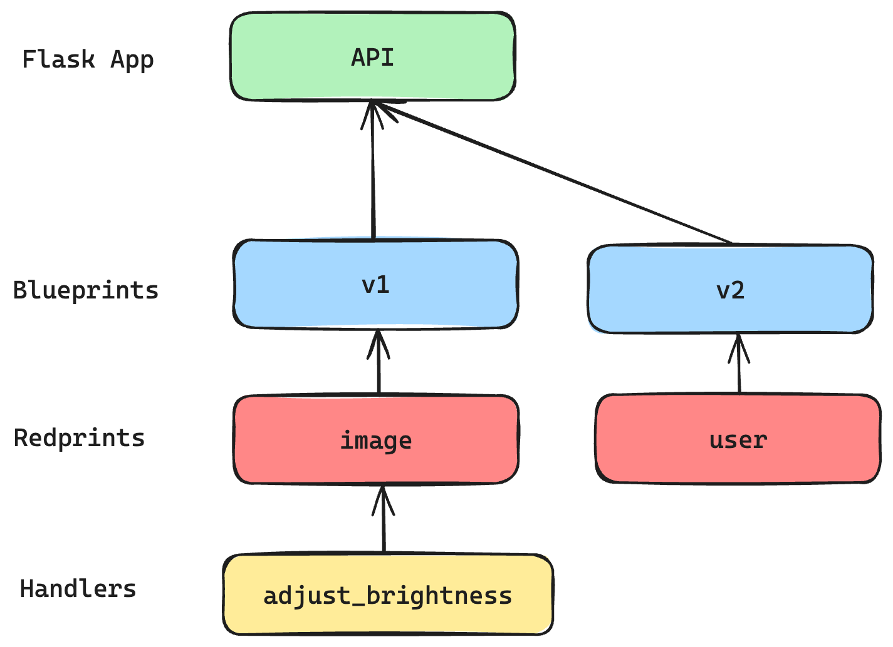
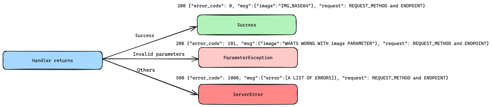

# Neolocus API

Welcome to Neolocus API, an image processing tool developed using Python Flask. This API is designed to enhance the brightness of images by 30%.

## Getting Started
### Prerequisites
Before deploying the API server, make sure you have Docker and Python installed on your machine. These tools are necessary for building and running the API server.
### Deployment
#### Setting Up the Server
1. ***Clone the Repository***

Begin by cloning the NeolocusAPI repository from GitHub:
```bash
git clone https://github.com/badbubble/NeolocusAPI.git
```
2. ***Configure Settings***

Navigate to `NeolocusAPI/app/config/settings.py` to adjust the settings according to your requirements:
```python
class Config:
    DEBUG = False  # debug mode
    INCREASE_BRIGHTNESS_RATE = 1.3  # increase rate
    DEFAULT_IMG_TYPE = 'PNG'  # default type of image
    MAX_IMG_SIZE = 5 * 1024 * 1024  # max image size 5MB
    MIN_IMG_SIZE = 10 * 1024  # min image size 10KB
```
3. ***Deploy Using Docker (Recommended)***

Use Docker to build and run the API on WSGI HTTP Server:

```bash
docker build -t neolocusapi .
docker run -d -p 8080:8080 neolocusapi
```
4. ***Alternative Local Deployment.***

If you prefer not to use Docker, install the necessary Python packages and run the server locally:


```bash
pip install -r requirements.txt
gunicorn --workers=3 --bind=0.0.0.0:8080 main:app
```


### Testing the API

1. ***Install Client Dependencies***

Install the required packages for the client script:


```bash
pip install -r client_requirements.txt
```

2. ***Run the Client Script***

Execute client.py with the necessary parameters to process an image:

```bash
python3 client.py --ip <ip_address> --port <port_number> --img_path <path_to_input_image> --save_path <path_to_output_image>
```
Example usage:


```bash
python3 client.py --ip 0.0.0.0 --port 8080 --img_path test_images/bedroom.png --save_path result_images/bedroom.png
```


## Features
### Redprint for Modular Endpoints
A 'Redprint' is a variant of Flask's 'Blueprint', designed to help developers organize larger applications into more manageable components focused on specific features,
For example, use api = Redprint("image") to define a module for image handling.
This approach simplifies routing; instead of repeatedly writing @api.route("/v1/image/upload"), 
a developer can simply use @api.route("upload").




```python
class Redprint:
    def __init__(self, name: str) -> None:
        self.name = name
        self.mound = []

    def route(self, rule, **options) -> Callable:
        def decorator(f: Callable) -> Callable:
            self.mound.append((f, rule, options))
            return f
        return decorator

    def register(self, bp: Blueprint, url_prefix: Optional[str] = None) -> None:
        if url_prefix is None:
            url_prefix = '/' + self.name
        for f, rule, options in self.mound:
            endpoint = self.name + '+' + \
                       options.pop("endpoint", f.__name__)
            bp.add_url_rule(url_prefix + rule, endpoint, f, **options)

```
### Standardized Error Handling


In this API project, every handler should return an APIException instead of a direct JSON result.
The APIException is a structured JSON response that includes the endpoint the client requested,
a message, an error code, and the HTTP status code. This standardizes the error handling across the application
by providing consistent and informative message or error responses.

Developers or clients can use the following table to determine what happend to their requests and do a more specific operation.

| APIException    | HTTP Status Code | Error code | Message format                                                                                                  | Description                              |
|-----------------|------------------|------------|-----------------------------------------------------------------------------------------------------------------|------------------------------------------|
| Success         | 200              | 0          | {"error_code": 0, "msg":{"image":"IMG_BASE64"}, "request": REQUEST_METHOD and ENDPOINT}                         | Handler successfully processed a request |
| ParameterException | 200              | 101        | {"error_code": 101, "msg":{"image":"WHATS WORNG WITH image PARAMETER"}, "request": REQUEST_METHOD and ENDPOINT} | Client's input is invalid                                                               |
|  ServerError    | 500              | 1000       | {"error_code": 1000, "msg":{"error":[A LIST OF ERRORS]}, "request": REQUEST_METHOD and ENDPOINT}                | Other errors                                                                                                     |

### Return Exception when meet with invalid parameters
Rewrite `wtforms.Form` to process requested data within validators and return ParameterException directly
if there is an invalid parameters instead of process it in handler.
```python
class BaseForm(Form):
    def __init__(self):
        data = request.get_json(silent=True)
        args = request.args.to_dict()
        super(BaseForm, self).__init__(data=data, **args)

    def validate_for_api(self):
        valid = super(BaseForm, self).validate()
        if not valid:
            raise ParameterException(msg=self.errors)
        return self
```

## Project Structure

Below is an overview of the project directory:

```bash
├── Dockerfile
├── README.md
├── app  # 
│   ├── __init__.py
│   ├── api
│   │   ├── __init__.py
│   │   └── v1
│   │       ├── __init__.py
│   │       └── image.py  # image handlers
│   ├── app.py  # create Flask app
│   ├── config
│   │   ├── __init__.py
│   │   └── settings.py  # setting files
│   ├── error
│   │   ├── __init__.py
│   │   ├── error.py
│   │   └── error_code.py
│   ├── internal
│   │   ├── __init__.py
│   │   └── image.py
│   ├── libs
│   │   ├── __init__.py
│   │   └── redprint.py
│   └── validators
│       ├── __init__.py
│       ├── base.py
│       └── image.py
├── client.py
├── main.py
├── test_main.py
└── test_images
    ├── bedroom.png
    ├── bedroom_brighter.png
    ├── brighter_cat.png
    └── cat.png

```


## Comprehensive Test Coverage


### Flask tests
test cases in `test_app.py`

| Test function | Description                     |
|---------------|---------------------------------|
|test_invalid_param_big_img| test posting a very big image   |
|test_invalid_param_small_img| test posting a very small image |
|test_invalid_param_empty_img| test posting an empty image     |
|test_png_img| test posting a png image        |
|test_jpg_img| test posting a jpg image        |
|test_abnormal_img| test posting an invalid image   |
### Image tests

| Original                     | Increase brightness            |
|------------------------------|--------------------------------|
|      |      |
|      |      |
|  |  |

## Next Steps
This section can outline future improvements, feature additions, and performance enhancements.
