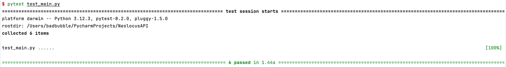

# Neolocus API

Welcome to Neolocus API, an image processing tool developed using Python Flask. This API is designed to enhance the brightness of images by 30%.


## Getting Started
### Prerequisites
Before deploying the API server, make sure you have Docker or Python@3.12 installed on your machine. These tools are necessary for building and running the API server.
### Deployment
#### Setting Up the Server
1. ***Clone the Repository***

Begin by cloning the NeolocusAPI repository from GitHub:
```bash
git clone https://github.com/badbubble/NeolocusAPI.git
```
2. ***Configure Settings***

Navigate to `NeolocusAPI/app/config/settings.py` to adjust the settings according to your requirements:
```python
class Config:
    DEBUG = False  # debug mode
    INCREASE_BRIGHTNESS_RATE = 1.3  # increase rate
    DEFAULT_IMG_TYPE = 'PNG'  # default type of image
    MAX_IMG_SIZE = 5 * 1024 * 1024  # max image size 5MB
    MIN_IMG_SIZE = 10 * 1024  # min image size 10KB
```
3. ***Deploy Using Docker (Recommended)***

Use Docker to build and run the API on WSGI HTTP Server:

```bash
docker build -t neolocusapi .
docker run -d -p 8080:8080 neolocusapi
```
4. ***Alternative Local Deployment.***

If you prefer not to use Docker, install the necessary Python packages and run the server locally:


```bash
pip install -r requirements.txt
gunicorn --workers=3 --bind=0.0.0.0:8080 main:app
```


### Testing the API

1. ***Install Client Dependencies***

Install the required packages for the client script:


```bash
pip install -r client_requirements.txt
```

2. ***Run the Client Script***

Execute client.py with the necessary parameters to process an image:

```bash
python3 client.py --ip <ip_address> --port <port_number> --img_path <path_to_input_image> --save_path <path_to_output_image>
```
Example usage:


```bash
python3 client.py --ip 0.0.0.0 --port 8080 --img_path test_images/bedroom.png --save_path result_images/bedroom.png
```


## Features
### Redprint for Modular Endpoints
A 'Redprint' is a variant of Flask's 'Blueprint', designed to help developers organize larger applications into more manageable components focused on specific features,
For example, use api = Redprint("image") to define a module for image handling.

This approach simplifies routing; instead of repeatedly writing @api.route("/v1/image/upload"), 
a developer can simply use @api.route("upload").


```python
class Redprint:
    def __init__(self, name: str) -> None:
        self.name = name
        self.mound = []

    def route(self, rule, **options) -> Callable:
        def decorator(f: Callable) -> Callable:
            self.mound.append((f, rule, options))
            return f
        return decorator

    def register(self, bp: Blueprint, url_prefix: Optional[str] = None) -> None:
        if url_prefix is None:
            url_prefix = '/' + self.name
        for f, rule, options in self.mound:
            endpoint = self.name + '+' + \
                       options.pop("endpoint", f.__name__)
            bp.add_url_rule(url_prefix + rule, endpoint, f, **options)

```
### Standardized Error Handling


In this API project, every handler should return an APIException instead of a direct JSON result.
The APIException is a structured JSON response that includes the endpoint the client requested,
a message, an error code, and the HTTP status code. This standardizes the error handling across the application
by providing consistent and informative message or error responses.

Developers or clients can use the following table to determine what happend to their requests and do a more specific operation.

| APIException    | HTTP Status Code | Error code | Message format                                                                                                  | Description                              |
|-----------------|------------------|------------|-----------------------------------------------------------------------------------------------------------------|------------------------------------------|
| Success         | 200              | 0          | {"error_code": 0, "msg":{"image":"IMG_BASE64"}, "request": REQUEST_METHOD and ENDPOINT}                         | Handler successfully processed a request |
| ParameterException | 200              | 101        | {"error_code": 101, "msg":{"image":"WHATS WORNG WITH image PARAMETER"}, "request": REQUEST_METHOD and ENDPOINT} | Client's input is invalid                                                               |
|  ServerError    | 500              | 1000       | {"error_code": 1000, "msg":{"error":[A LIST OF ERRORS]}, "request": REQUEST_METHOD and ENDPOINT}                | Other errors                                                                                                     |

### Raise an Exception for Invalid Parameters

Modify the wtforms.Form to process the requested data within its validators. If any parameters are invalid, immediately return a ParameterException directly from the validators, instead of handling it later in the application handler.
```python
class BaseForm(Form):
    def __init__(self):
        data = request.get_json(silent=True)
        args = request.args.to_dict()
        super(BaseForm, self).__init__(data=data, **args)

    def validate_for_api(self):
        valid = super(BaseForm, self).validate()
        if not valid:
            raise ParameterException(msg=self.errors)
        return self
```

## Project Structure

Below is an overview of the project directory:

```bash
├── Dockerfile
├── README.md
├── app  # 
│   ├── __init__.py
│   ├── api  # define apis
│   │   ├── __init__.py
│   │   └── v1  # api version
│   │       ├── __init__.py
│   │       └── image.py  # image handlers
│   ├── app.py  # create Flask app
│   ├── config
│   │   ├── __init__.py
│   │   └── settings.py  # setting files
│   ├── error
│   │   ├── __init__.py
│   │   ├── error.py # base class APIException
│   │   └── error_code.py # specific Exceptions defined by developers
│   ├── internal  # core code for processing user's input
│   │   ├── __init__.py
│   │   └── image.py  # code code for processing images
│   ├── libs  # libraries used by flask app
│   │   ├── __init__.py
│   │   └── redprint.py
│   └── validators  # valid for parameters
│       ├── __init__.py
│       ├── base.py   # base call validator to return APIException for invalid parameters
│       └── image.py  # valid for image endpoint parameters
├── client.py  # client test script
├── main.py  # main file of API
├── test_main.py # pytest for flask API
└── test_images  # images used for testing
    ├── bedroom.png
    ├── bedroom_brighter.png
    ├── brighter_cat.png
    └── cat.png

```


## Comprehensive Test Coverage


### Flask tests
Exectue `test_main.py` with pytest to test this project:
```bash
pytest test_main.py
```

| Test function | Description                     | IS_PASS|
|---------------|---------------------------------|---|
|test_invalid_param_big_img| test posting a very big image   |✅|
|test_invalid_param_small_img| test posting a very small image |✅|
|test_invalid_param_empty_img| test posting an empty image     |✅|
|test_png_img| test posting a png image        |✅|
|test_jpg_img| test posting a jpg image        |✅|
|test_abnormal_img| test posting an invalid image   |✅|


### Image tests

| Original                     | Brighter                       |
|------------------------------|--------------------------------|
|      |      |
|      |      |
|  |  |

## Performance Analysis

This section outlines the performance analysis of our HTTP web servers and suggests areas for future improvements.
### Benchmarking with ApacheBench

Using the ApacheBench (ab) tool to measure the performance of our web servers. Below is the command used to initiate the benchmark:
```bash
ab -n 20000 -c 100 -p postdata.json -T 'application/json' http://192.168.31.147:8080/v1/image/adjust_brightness
```
To monitor the Virtual Size (VSZ) and Resident Set Size (RSS) during benchmarking, using the following command:
```bash
ps aux | grep python | grep app | awk '{vsz_sum+=$5; rss_sum+=$6} END {print "Total VSZ: " vsz_sum/1024 " MB, Total RSS: " rss_sum/1024 " MB"}'
```
The memory usage results indicate no immediate memory leak issues. However, ongoing monitoring is recommended.


The server successfully processed 20,000 requests without any failures. 
However, the response times averaged 623.597 ms per request, with peaks up to 5391 ms, 
and the server achieved a throughput of 160.36 requests per second.
Despite the decent throughput,
the significant variability in response times could indicate underlying performance bottlenecks.

```text
Server Software:        gunicorn
Server Hostname:        192.168.31.147
Server Port:            8080

Document Path:          /v1/image/adjust_brightness
Document Length:        147290 bytes

Concurrency Level:      100
Time taken for tests:   124.719 seconds
Complete requests:      20000
Failed requests:        0
Total transferred:      2948940000 bytes
Total body sent:        2623020000
HTML transferred:       2945800000 bytes
Requests per second:    160.36 [#/sec] (mean)
Time per request:       623.597 [ms] (mean)
Time per request:       6.236 [ms] (mean, across all concurrent requests)
Transfer rate:          23090.43 [Kbytes/sec] received
                        20538.45 kb/s sent
                        43628.87 kb/s total

Connection Times (ms)
              min  mean[+/-sd] median   max
Connect:        3   11   7.9      9     144
Processing:   181  611 248.1    589    5349
Waiting:       59  578 245.9    559    5310
Total:        186  622 248.8    598    5391

Percentage of the requests served within a certain time (ms)
  50%    598
  66%    616
  75%    632
  80%    645
  90%    689
  95%    740
  98%    839
  99%    981
 100%   5391 (longest request)

```
### Next Steps
* optimizing application code
* exploring scaling options
* implementing robust monitoring and profiling tools.
